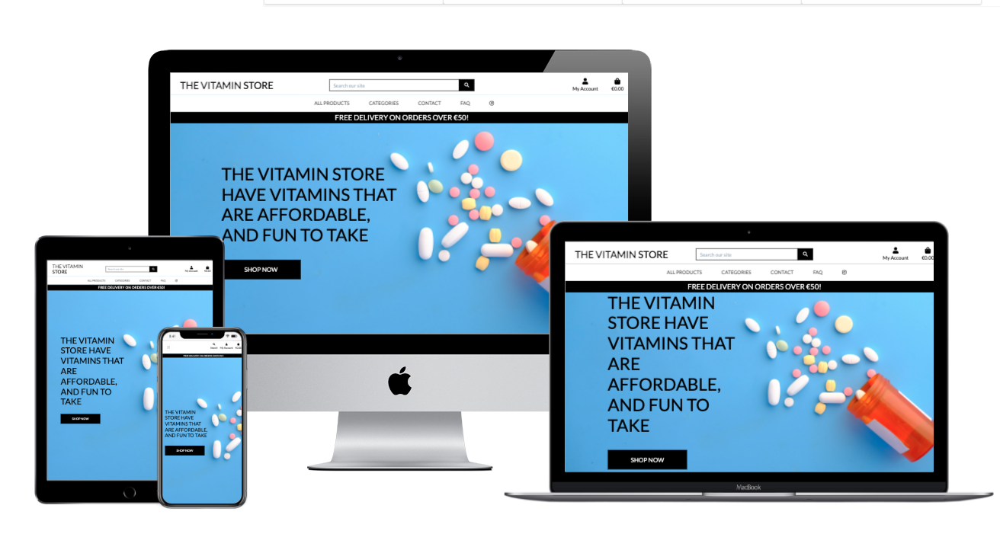
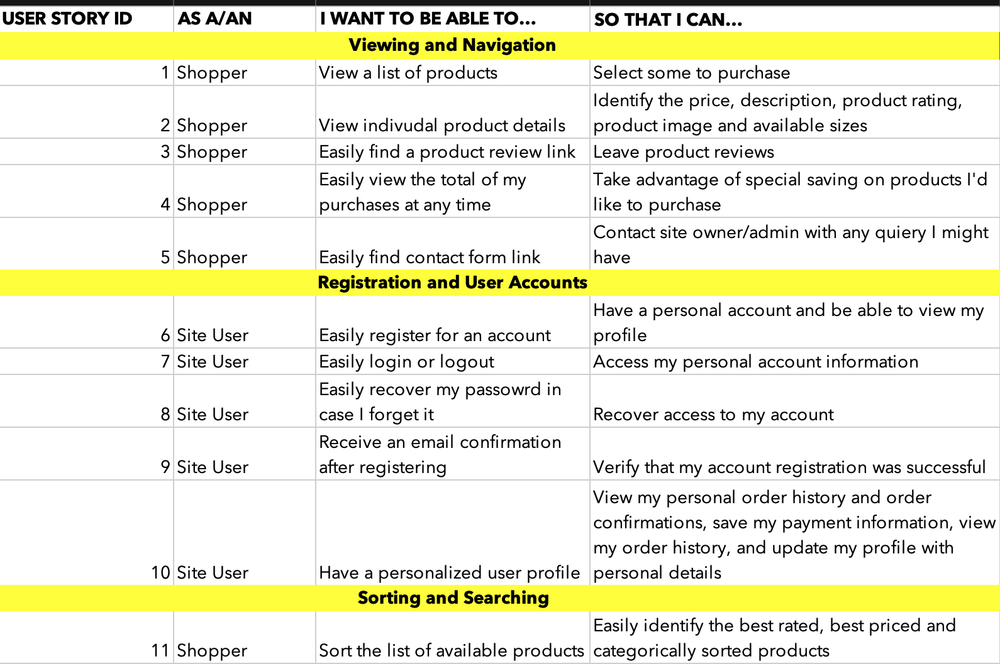
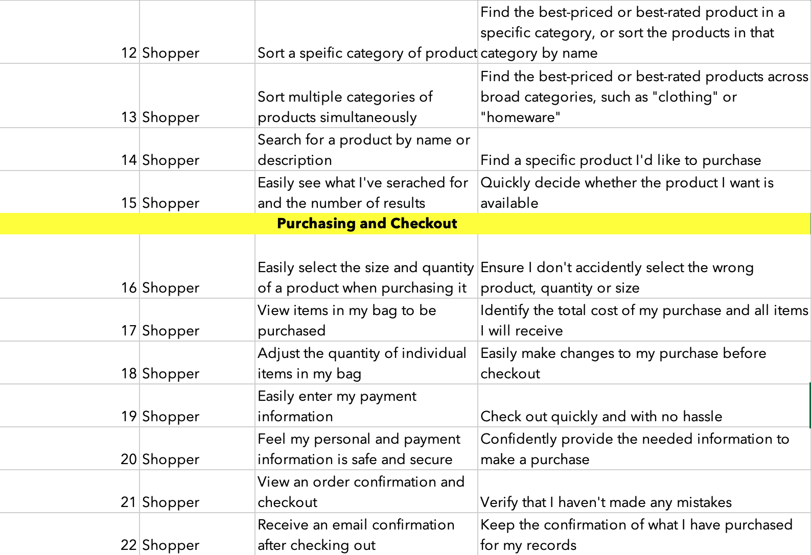
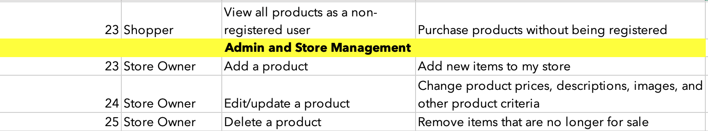
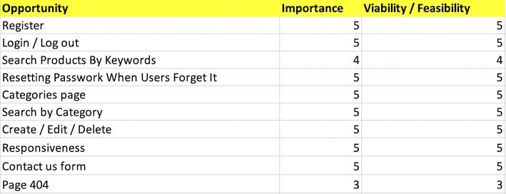
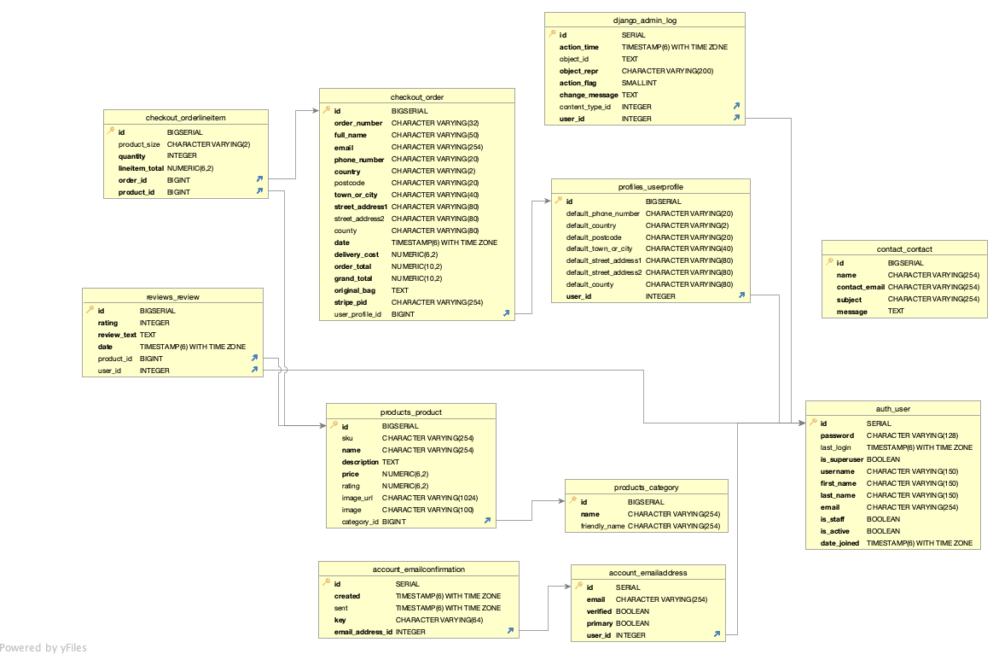

# The Vitamin Store

The Vitamin Store is an online e-commerce vitamin store. This site was developed for my milestone 4 project as part of the Code Institute - Full Stack Diploma in Software Development Course.
 

Link to [live site](https://the-vitamin-store.herokuapp.com/)

## **Table of Content**
* [User Experience Design (UX)](#User-Experience-Design)
    * [The Strategy Plane](#The-Strategy-Plane)
        * [User stories](#User-Stories)
    * [The Scope Plane](#The-Scope-Plane)
    * [The Skeleton Plane](#The-Skeleton-Plane)
        * [Wireframes](#Wireframes)
        * [Database Design](#Database-Design)
        * [Security](#Security)
    * [The Surface Plane](#The-Surface-Plane)
        * [Design](#Design)
            * [Colour Scheme](#Colour-Scheme)
            * [Typography](#Typography)
            * [Imagery](#Imagery)
            * [Database](#Database)
    * [Differences to Design](#Differences-to-Design)
    * [Features](#Features)
    * [Existing Features](#Existing-Features)
    * [Future Features](#Features-Left-to-Implement)
* [Technologies](#Technologies)
* [Testing](#Testing)
    * [Test Strategy](#Test-Strategy)
    * [Test Results](#Test-Results)
    * [Isses and Resolutions](#Issues-and-Resolutions-to-issues-found-during-testing)
* [Deployment](#Deployment)
    * [Project Creation](#Project-Creation)
    * [GitHub Pages](#Deployment-To-Heroku)
    * [The Vitamin Store](#The-Vitamin-Store)
    * [Fork Project](#Fork-Project)
* [Credits](#Credits)
  * [Code](#Code)
  * [Acknowledgements](#Acknowledgements)

  ****
## User Experience Design
### **The Strategy Plane**

#### Project goals 

* Create a website that uses Stripe payments.
* To make a full-stack site that uses HTML, CSS, JavaScript, Python + Django.
* Create a website that uses a relational database.
* To make a full-stack site based around business logic used to control a centrally-owned database.

* This website was created for for the sole purpose of completing my Milestone 4 Project for the "Code Institute’s" full stack software developer program.
  The Vitamin Store is a eCommerce site aimed at everyone that wants too or need to maintain they’re health, so we keep it simple. We supply vitamins that are affordable, fun to take, easy to remember to take. The site is designed to be responsive and easy to navigate on a range of devices to make it easily accessible for all users.

* This site was built for educational purpose and no deliveries will be fulfilled. 

### User stories
 
 
 

 

### **The Skeleton Plane**
#### Wireframes
* Desktop size wireframes can be viewed [here](https://github.com/Sonicbasedrop/the_vitamin_store/tree/main/readme_images/wireframes/desktop_wireframes_png) 
* Tablet size wireframes can be viewed [here](https://github.com/Sonicbasedrop/the_vitamin_store/tree/main/readme_images/wireframes/tablet_wireframes_png) 
* Mobile size wireframes can be viewed [here](https://github.com/Sonicbasedrop/the_vitamin_store/tree/main/readme_images/wireframes/mobile_wireframes_png) 

### **The Surface Plane**
### Design

#### Planned Colour Scheme
* The main colours of the site   
 
* The main website text is black.
#### Typography
* Headings: Lato 
* Main body text : Lato

#### Imagery
* The background image used on all pages is taken with permission from unsplash.com view [here](https://unsplash.com/) contributor by the name of Towfiqu barbhuiya view image [here](https://unsplash.com/photos/w8p9cQDLX7I) see his compplete unsplash portfolio [Here](https://unsplash.com/@towfiqu999999).

* The product image used with permission from bulk.com se view [here](https://www.bulk.com/) | view product image [here](https://www.bulk.com/uk/uc-ii-collagen-capsules.html).

### **The Scope Plane**

### **Features Implemented:**
##### **Create Profile**
- Users are able to:
  - Create a profile to save their orders and personal information
  - Confirm their details are correct via email verification
  - Store details for faster checkout

##### **Log in to Profile**
- Users are able to:
  - Log in to profile to see their orders and personal information
  - Edit personal information if required

##### **Products Page**
- Users are able to:
  - See the products for sale on the site
  - Sort products by A-Z, Name, Category, Price, Rating.
  - See all products
  - Price of product
  - See rating of product

##### **Product Details Page**
- Users are able to:
  - Click the products to find out more information including
  - Name,  price, SKU, category, Rating
  - Add products to bag to buy
  - See reviews of products and also review the products if logged in

- Super users are able to:
  - Add, edit and delete products

##### **Products Management**
If the user is a super user they can:
  - Add a product and image of product
  - Edit a product
  - Delete a Product

##### **Bag**
- Users are able to:
  - Adjust number of products in bag if they require
  - Find out delivery costs
  - Find out how much more they need to spend to get free delivery
  - Clearly see the total of their items by quantity and grand total

##### **Checkout**
- Users can:
  - Save time as personal details pulled from profile page if user is logged in
  - Save their delivery information to their profile
  - Clearly see how much they will be charged for their items and delivery

- Logged in users can:
  - Add a Review
 ##### **Navigation**

**Header**

- All users can:
  - Navigate to home, products, bag pages, Contact page, Faq page

- Users logged in can access:
  - Profile pages, review page

- Users not logged in can:
  - Access log in and register pages

### **Error Pages**

#### *404.html*

 - 404 page created to redirect users back to the main site in case of an error

#### *403.html*

 - 403 page created to redirect users back to the main site in case they try to access a page they are not authorised to

#### *500.html*

 - 500 error page created to redirect users to the main site after a server error
 
 

[Back to Table of Content](#table-of-content)

### **Database Design** 

