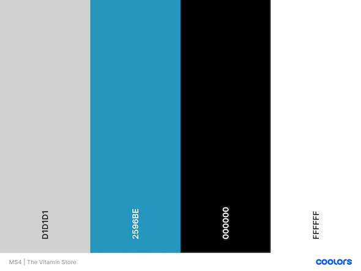

# The Vitamin Store

## **Table of Content**
* [User Experience Design (UX)](#User-Experience-Design)
    * [The Strategy Plane](#The-Strategy-Plane)
        * [Site owner/Admin/Superuser goals](#Site-owner-Admin-Superuser-goals)
        * [User stories](#User-Stories)
    * [The Scope Plane](#The-Scope-Plane)
    * [The Structure Plane](#The-Structure-Plane)
    * [The Skeleton Plane](#The-Skeleton-Plane)
        * [Wireframes](#Wireframes)
        * [Database Design](#Database-Design)
        * [Security](#Security)
    * [The Surface Plane](#The-Surface-Plane)
        * [Design](#Design)
            * [Colour Scheme](#Colour-Scheme)
            * [Typography](#Typography)
            * [Imagery](#Imagery)
    * [Differences to Design](#Differences-to-Design)
- [Features](#Features)
    * [Existing Features](#Existing-Features)
    * [Future Features](#Features-Left-to-Implement)
* [Technologies](#Technologies)
* [Testing](#Testing)
    * [Test Strategy](#Test-Strategy)
    * [Test Results](#Test-Results)
    * [Isses and Resolutions](#Issues-and-Resolutions-to-issues-found-during-testing)
* [Deployment](#Deployment)
    * [Project Creation](#Project-Creation)
    * [GitHub Pages](#Deployment-To-Heroku)
    * [Run Locally](#Run-Locally)
    * [Fork Project](#Fork-Project)
* [Credits](#Credits)
  * [Code](#Code)
  * [Acknowledgements](#Acknowledgements)

  ****
  ## User Experience Design
### **The Strategy Plane**

This website was created for for the sole purpose of completing my Milestone 4 Project for the "Code Institute’s" full stack software developer program.
The Vitamin Store is a eCommerce site aimed at everyone that wants too or need to maintain they’re health, so we keep it simple. We supply vitamins that are affordable, fun to take, easy to remember to take. The site is designed to be responsive and easy to navigate on a range of devices to make it easily accessible for all users.

This site was built for educational purpose and no deliveries will be fulfilled. 

### User stories
 ### Site owner Admin Superuser goals:
* I want to have a payment system implemented.
* I want to be able to add products to the store.
* I want to be able edit products to the store.
* I want to be able delete products to the store.
* I want to be able change descriptions, price, images in the store.
* I want to have a contact form where users contact site owner/admin with any questions they may have.
* I want user how register an account, will get a confirmation email upon registration.

 ### As a new/unregistered user:
* As a user, I want the main purpose of the site to be clear so that I immediately know what the site is 
intended for upon entering the site.
* As a user, I want to easily navigate the site so that I can find products quickly with ease.
* As a user, I want the website to be responsive so that I can clearly view the webpages from my mobile, 
tablet or desktop.

* As a user, I want to be able to register to the website so that I can create and manage my profile.
* As a user, I want to be able to sort search for and sort products by price, name, category and rating.
* As a user, I to be able to contact the site owner so that I can ask them about have any questions I may have.

* As a user, I want to be able to return to the main site without having to use the browser buttons so 
that I can easily return to the website if I navigate to a page that doesn't exist.
* As a user, I want to be able to see have a running total of my cart.
* As a user, I want to be able to view my cart.

* As a user, I want to be able to view the full order before entering card details 
* As a user, I want to receive email notifications upon making an order
* As a user, I want to be able to buy products without registering an account.

* As a user, I want to be able to see any special offers.
* As a user, I want to receive email confirmation upon regestering a account.
* As a user, I want to be able to add, edit and delete the quantity of items from my cart.
* As a user, I want to be able to leave a review.

 ### As a registered user:
* As a user, I want to be able login to the site with my personal details.
* As a user, I want to be able to reset my password in case I forget it.
* As a user, I want to able update my personal details on my profile page.
* As a user, I want to able see my order history on my profile page.

* As a user, I want to be able to sort search for and sort products by price, name, category and rating.
* As a user, I want to be able to see have a running total of my cart.
* As a user, I want to be able to view my cart.

* As a user, I to be able to contact the site owner so that I can ask them about have any questions I may have.
* As a user, I want to be able to add, edit and delete the quantity of items from my cart. 
* As a user, I want to be able to view the full order before entering card details

* As a user, I want to be able to see any special offers.
* As a user, I want to receive email notifications upon making an order
* As a user, I want to be able to add, edit and delete the quantity of items from my cart.
* As a user, I want to be able to leave a review.

 

### **The Skeleton Plane**
#### Wireframes PNG Format
* Desktop size wireframes can be viewed [here](https://github.com/Sonicbasedrop/the_vitamin_store/tree/main/readme_images/wireframes/desktop_wireframes_png) 
* Tablet size wireframes can be viewed [here](https://github.com/Sonicbasedrop/the_vitamin_store/tree/main/readme_images/wireframes/tablet_wireframes_png) 
* Mobile size wireframes can be viewed [here](https://github.com/Sonicbasedrop/the_vitamin_store/tree/main/readme_images/wireframes/mobile_wireframes_png) 

### **The Surface Plane**
### Design

#### Planned Colour Scheme
* The main colours of the site   
 
* The main website text is black.
#### Typography
* Headings: Bebas Neue. 
* Main body text: Montserrat

#### Imagery
* The background image used on all pages is taken with permission from unsplash.com view [here](https://unsplash.com/) contributor by the name of Towfiqu barbhuiya view image [here](https://unsplash.com/photos/w8p9cQDLX7I) see his compplete unsplash portfolio [Here](https://unsplash.com/@towfiqu999999).

* The product image used with permission from bulk.com se view [here](https://www.bulk.com/) | view product image [here](https://www.bulk.com/uk/uc-ii-collagen-capsules.html).

### **The Scope Plane**

**Features planned:**
* Responsive design.
* Website title and information on the site purpose.
* Navigation Menu (Site Wide).
* Footer with links (Site Wide).
* MongoDB databases to store information and user login/profile information.
* MongoDB databases to store site owner/admin information and user login/profile information.
* CRUD Functionality.
* Login functionality.
* Logout functionality.
* User profile page.
* User ability edit profile page.
* User ability delete profile from site.
* Payment functionality.
* Products displayed and searchable to all users.
* Registered user ability to see there order  history.
* Admin ability to add, edit, delete products.
* Admin ability to delete user account.
* Leave review.
* Ability to contact site owner/admin.
* Confirmation email upon registering and upon purchase of product.

